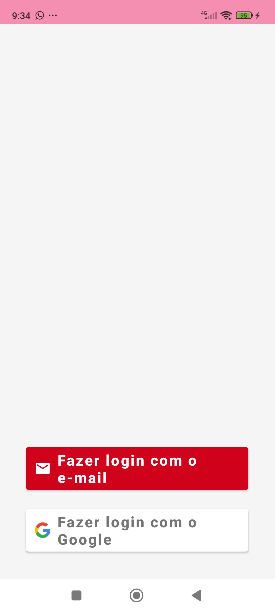
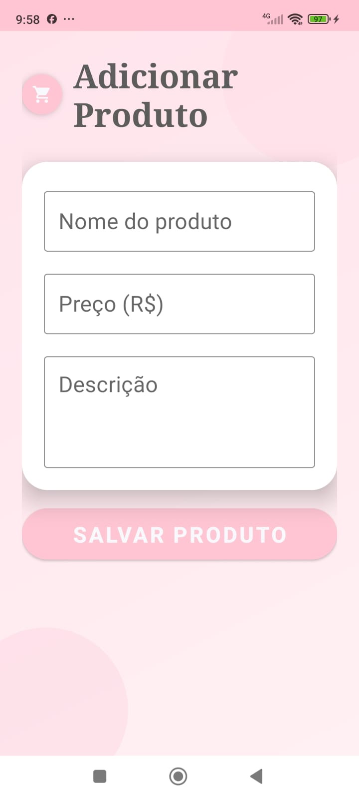
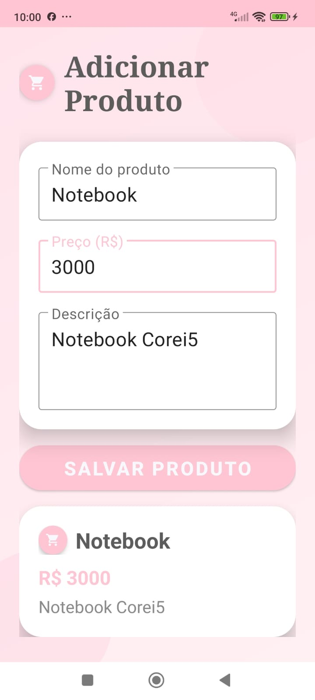
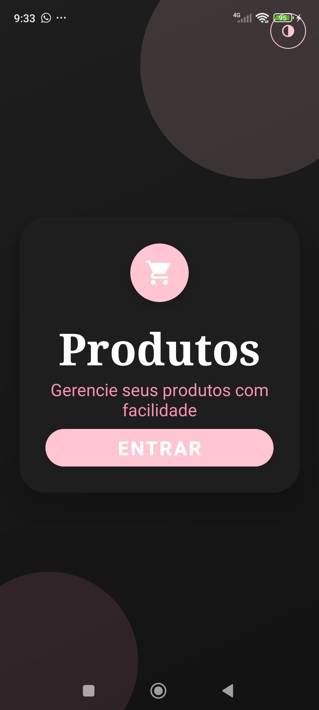
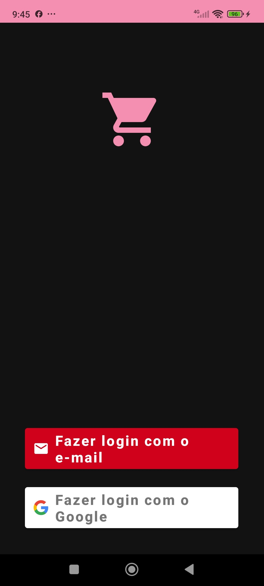
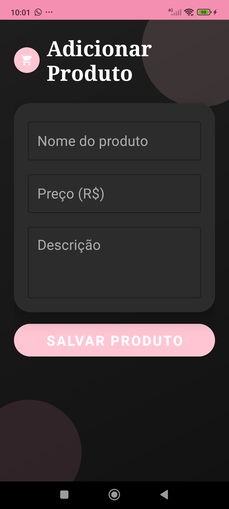
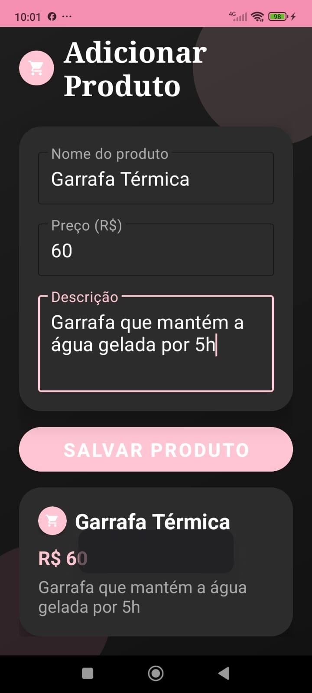
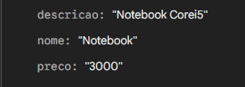
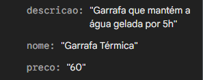

# 🛒 AppProdutos - Gerenciador de Produtos Pessoal

Aplicativo Android desenvolvido em **Kotlin** para gerenciar uma lista pessoal de produtos. Construído com Firebase Authentication (FirebaseUI) e Cloud Firestore para persistência na nuvem.

---

## 📋 Funcionalidades

### 1. 🔐 Tela de Boas-vindas (`WelcomeActivity`)
O usuário pode entrar com e-mail/senha ou conta Google utilizando o FirebaseUI.
**Comportamento:**
- Login com e-mail → fluxo de autenticação via FirebaseUI
- Login com Google → OAuth via Google Sign-In
- Já autenticado → redireciona diretamente para a lista de produtos
- Botão de alternância entre tema claro e escuro

### 2. 📦 Gerenciador de Produtos (`ProdutoActivity`)
Exibe e gerencia os produtos do usuário salvos no Firestore.
**Comportamento:**
- Campos para nome, preço e descrição do produto
- Botão salvar → persiste os dados no Firestore
- Exibe card com os dados do produto após salvar
- Apenas usuários autenticados têm acesso

---

## 📸 Screenshots

### 🌞 Tema Claro (Light Mode)

<table>
  <tr>
    <th align="center">Boas-vindas</th>
    <th align="center">Login</th>
    <th align="center">Sem Produto</th>
    <th align="center">Com Produto</th>
  </tr>
  <tr>
    <td align="center"></td>
    <td align="center"></td>
    <td align="center"></td>
    <td align="center"></td>
  </tr>
</table>

### 🌙 Tema Escuro (Dark Mode)

<table>
  <tr>
    <th align="center">Boas-vindas</th>
    <th align="center">Login</th>
    <th align="center">Sem Produto</th>
    <th align="center">Com Produto</th>
  </tr>
  <tr>
    <td align="center"></td>
    <td align="center"></td>
    <td align="center"></td>
    <td align="center"></td>
  </tr>
</table>

### ☁️ Banco de Dados Firestore

<table>
  <tr>
    <th align="center">Firestore 1</th>
    <th align="center">Firestore 2</th>
  </tr>
  <tr>
    <td align="center"></td>
    <td align="center"></td>
  </tr>
</table>

---

## 🗂️ Estrutura do Projeto

```
app/src/main/
├── java/br/edu/fatecpg/firebaseprodutos/
│   ├── ProdutoActivity.kt
│   └── WelcomeActivity.kt
└── res/
    ├── drawable/
    │   ├── bg_gradient.xml
    │   ├── bg_gradient.xml (night)
    │   ├── blob_bottom.xml
    │   ├── blob_top.xml
    │   ├── ic_dark_mode.xml
    │   ├── ic_logo_firebaseui.xml
    │   └── ic_shopping_cart.xml
    ├── layout/
    │   ├── activity_produto.xml
    │   └── activity_welcome.xml
    ├── mipmap/
    │   └── ic_launcher (pink shopping cart)
    └── values/
        ├── colors.xml
        ├── colors.xml (night)
        ├── themes.xml
        └── themes.xml (night)
```

---

## 🧩 Modelo de Dados

```kotlin
val produto = hashMapOf(
    "nome"      to nome,
    "preco"     to preco,
    "descricao" to descricao,
    "uid"       to uid
)
```

---

## 🏗️ Arquitetura

O projeto segue uma estrutura simples de **View + Firebase**, adequada para o escopo do aplicativo.

| Camada | Responsabilidade |
|---|---|
| **WelcomeActivity** | Autenticação via FirebaseUI (e-mail e Google) |
| **ProdutoActivity** | CRUD de produtos com Firestore |
| **Firestore** | Persistência na nuvem por usuário autenticado |

---

## 🛠️ Tecnologias

- **Linguagem:** Kotlin
- **Autenticação:** Firebase Authentication + FirebaseUI
- **Banco na nuvem:** Cloud Firestore
- **Componentes de UI:** `CardView`, `CoordinatorLayout`, `MaterialButton`, `TextInputLayout`
- **Tema:** Suporte a modo claro e escuro (DayNight)
- **View Binding:** Ativado

---

## 🔒 Regras do Firestore

```
rules_version = '2';
service cloud.firestore {
  match /databases/{database}/documents {
    match /{document=**} {
      allow read, write: if request.auth != null;
    }
  }
}
```

---

## ▶️ Como executar

1. Clone o repositório:
   ```bash
   git clone https://github.com/seuusuario/AppProdutos.git
   ```
2. Abra o projeto no **Android Studio**
3. Adicione o arquivo `google-services.json` na pasta `app/`
4. Adicione o SHA-1 do seu projeto no Firebase Console
5. Conecte um dispositivo ou inicie um emulador
6. Certifique-se que a **Depuração USB** está ativada no dispositivo
7. Clique em **Run ▶️** (ou `Shift + F10`)

---
